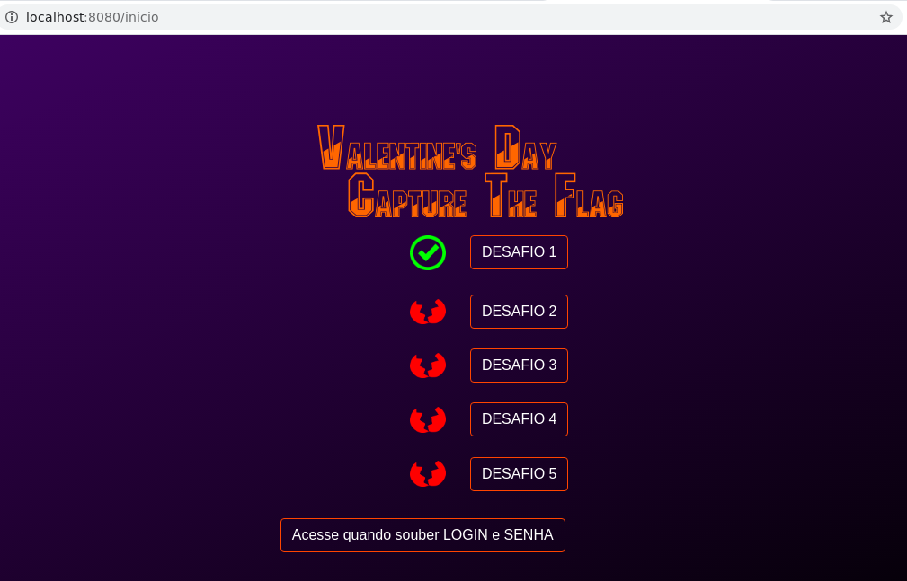

# ctf-diadosnamorados

Capture the Flag Valentine's Day
Foi uma brincadeira que criei no dia dos namorados.

Utiliza Spring Boot com as dependências:
 - Spring Security;
 - Web;
 - Thymeleaf;
 - JPA;
 - mysql;
 
A utilização do banco é opcional, utilizei para o controle também como forma de segurança à ataques na plataforma.

A inserção do usuário de acesso pode ser feita direto no banco, ou atravez dos métodos "formPessoa" e "adicionar", ambos estão desativados na Classe PessoaController
OBS: para ser inserido direto no banco é necessário a encriptação da chave, nos parâmetros do SpringSecurity.

#Home

